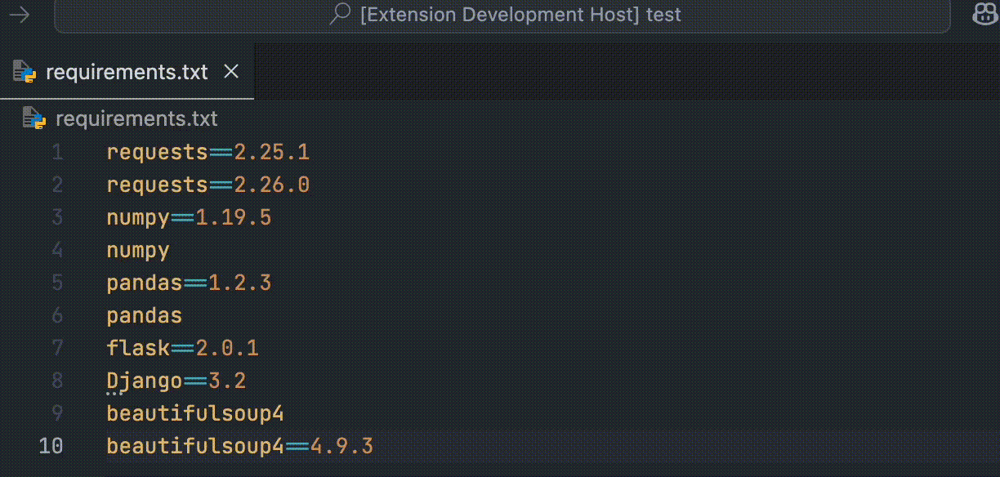

# ReqTidy README

ReqTidy is a Visual Studio Code extension that helps you keep your `requirements.txt` files clean and organized by sorting the entries alphabetically and removing duplicates.

## Features

- **Sort Requirements**: Automatically sorts the entries in your `requirements.txt` file alphabetically.
- **Remove Duplicates**: Removes duplicate entries, keeping only the latest version if multiple versions are specified.
- **Configuration Option**: Allows you to enable or disable the removal of duplicate entries through a configuration setting.

## Requirements

There are no additional requirements or dependencies for this extension.

## Extension Settings

This extension contributes the following settings:

* `reqTidy.removeDuplicates`: Enable/disable the removal of duplicate entries in `requirements.txt` files (default: enabled).

## Known Issues

There are no known issues at this time. If you encounter any problems, please report them on the [GitHub issues page](https://github.com/yourusername/reqtidy/issues).

## Release Notes

### 1.0.0

- Initial release of ReqTidy.
- Added functionality to sort `requirements.txt` files alphabetically.
- Added functionality to remove duplicate entries in `requirements.txt` files.
- Configuration option `reqTidy.removeDuplicates` to enable or disable duplicate removal (default: enabled).

**Enjoy!**